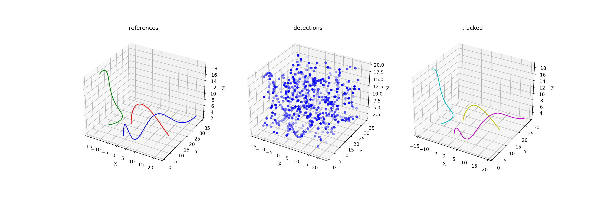

# TrackTuner

**TrackTuner** is a tool designed to optimize parameters for a multi-object tracker. It offers a comprehensive framework with multiple components for synthetic data generation, tracking, evaluation, optimization, and visualization. 

---

## Features

### 1. Synthetic Reference and Detection Generator
- **Reference Generator**: Produces tracks of a specified length with randomized movement patterns.
- **Detection Generator**: Mimics imperfections in object detection by:
  - Removing some track detections.
  - Randomizing detection positions.
  - Adding false detections.

### 2. Tracker Runner
- Runs a multi-object tracker on the generated detections.
- Accepts input parameters for noise, covariances, and m/n logic.
- Outputs tracks in the same format as the reference files for easy comparison with original tracks.

### 3. Performance Evaluator
- Compares output tracks and reference tracks.
- Gathers metrics such as:
  - Track percentages.
  - Track switches.
  - False positives.

### 4. Parameter Optimizer
- Optimizes tracker parameters using **Optuna**.
- Runs multiple trials to find the best-performing parameters for the tracker.

### 5. Visualizer
- Provides tools for visual comparison of:
  - Reference tracks.
  - Input tracks.
  - Synthetic detections.
- Simplifies analysis with intuitive visual representations.

---

